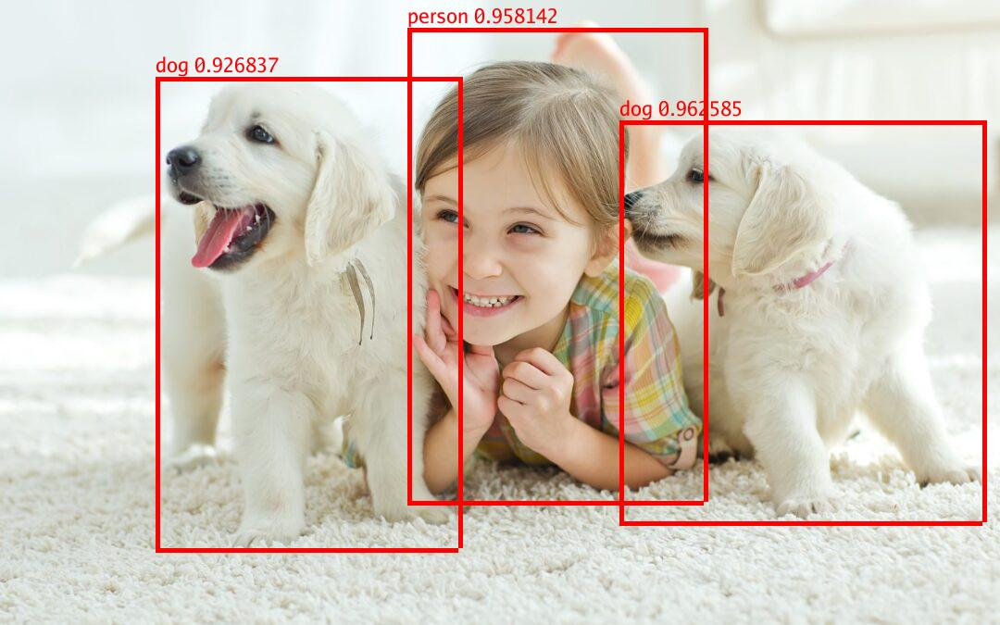
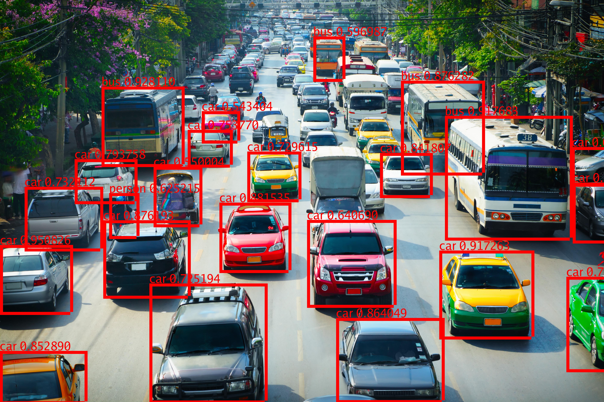

# yolotriton

[](https://pkg.go.dev/github.com/dev6699/yolotriton)
[](https://goreportcard.com/report/github.com/dev6699/yolotriton)
[](LICENSE)

Go (Golang) gRPC client for YOLO-NAS, YOLOv8 inference using the Triton Inference Server.

## Installation

Use `go get` to install this package:

```bash
go get github.com/dev6699/yolotriton
```

### Get YOLO-NAS, YOLOv8 TensorRT model
Replace `yolov8m.pt` with your desired model
```bash
pip install ultralytics
yolo export model=yolov8m.pt format=onnx
trtexec --onnx=yolov8m.onnx --saveEngine=model_repository/yolov8/1/model.plan
```

References:
1. https://docs.nvidia.com/deeplearning/tensorrt/quick-start-guide/index.html
2. https://docs.ultralytics.com/modes/export/
3. https://github.com/NVIDIA/TensorRT/tree/master/samples/trtexec

### Export of quantized YOLO-NAS INT8 model
1. Export quantized onnx model
```python

from super_gradients.conversion.conversion_enums import ExportQuantizationMode
from super_gradients.conversion import DetectionOutputFormatMode
from super_gradients.common.object_names import Models
from super_gradients.training import models

# From custom model
# model = models.get(Models.YOLO_NAS_S, num_classes=1, checkpoint_path='ckpt_best.pth')
model = models.get(Models.YOLO_NAS_S, pretrained_weights="coco")
export_result = model.export(
    "yolo_nas_s_int8.onnx",
    output_predictions_format=DetectionOutputFormatMode.BATCH_FORMAT,
    quantization_mode=ExportQuantizationMode.INT8 # or ExportQuantizationMode.FP16
)

print(export_result)

```
2. Convert to TensorRT with INT8 builder
```bash
trtexec --onnx=yolo_nas_s_int8.onnx --saveEngine=yolo_nas_s_int8.plan --int8
```
References:
1. https://github.com/Deci-AI/super-gradients/blob/b5eb12ccd021ca77e947bf2dde7e84a75489e7ed/documentation/source/models_export.md

### Start trinton inference server
```bash
docker compose up tritonserver
```
References:
1. https://docs.nvidia.com/deeplearning/triton-inference-server/user-guide/docs/user_guide/model_repository.html

### Sample usage
Check [cmd/main.go](cmd/main.go) for more details.

- For help
```bash
go run cmd/main.go --help
```
```bash
  -b    Run benchmark.
  -i string
        Inference Image. (default "images/1.jpg")
  -m string
        Name of model being served (Required) (default "yolonas")
  -n int
        Number of benchmark run. (default 1)
  -o float
        Intersection over Union (IoU) (default 0.7)
  -p float
        Minimum probability (default 0.5)
  -t string
        Type of model. Available options: [yolonas, yolonasint8, yolov8] (default "yolonas")
  -u string
        Inference Server URL. (default "tritonserver:8001")
  -x string
        Version of model. Default: Latest Version
```

- Sample usage with yolonasint8 model
```bash
go run cmd/main.go -m yolonasint8 -t yolonasint8 -i images/1.jpg         
```
```
1. processing time: 123.027909ms
prediction:  0
class:  dog
confidence: 0.96
bboxes: [ 669 130 1061 563 ]
---------------------
prediction:  1
class:  person
confidence: 0.96
bboxes: [ 440 30 760 541 ]
---------------------
prediction:  2
class:  dog
confidence: 0.93
bboxes: [ 168 83 495 592 ]
---------------------
```

- Sample usage to get benchmark results
```bash
go run cmd/main.go -m yolonasint8 -t yolonasint8 -i images/1.jpg  -b -n 10
```
```
1. processing time: 64.253978ms
2. processing time: 51.812457ms
3. processing time: 80.037468ms
4. processing time: 96.73738ms
5. processing time: 87.22928ms
6. processing time: 95.28627ms
7. processing time: 61.609115ms
8. processing time: 87.625844ms
9. processing time: 70.356198ms
10. processing time: 74.130759ms
Avg processing time: 76.93539ms
```


### Results

| Input                       | Ouput                                   |
| --------------------------- | --------------------------------------- |
|   |   |
|   |   |