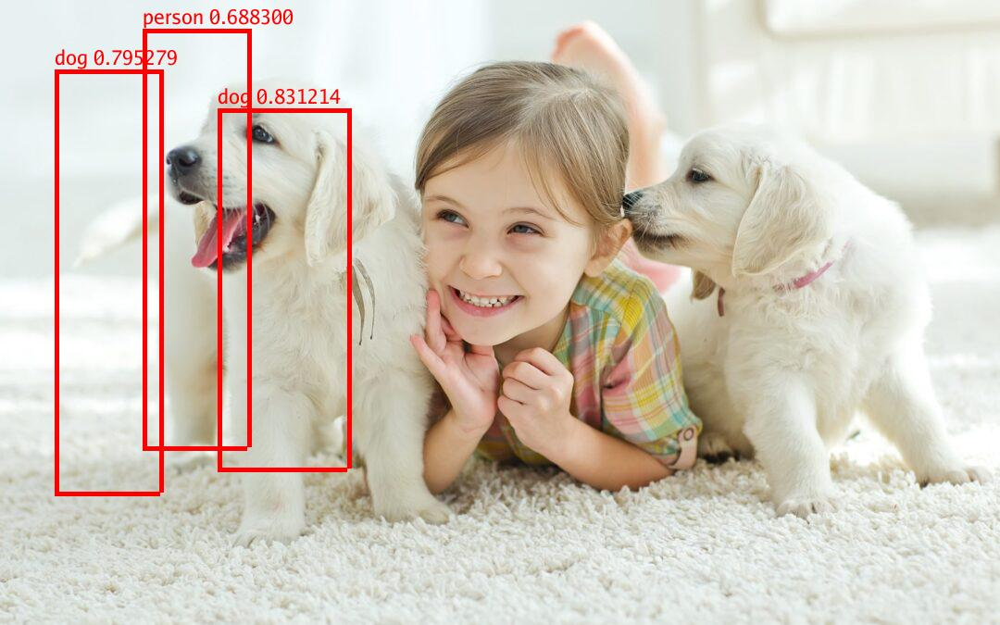

# yolotriton

[](https://pkg.go.dev/github.com/dev6699/yolotriton)
[](https://goreportcard.com/report/github.com/dev6699/yolotriton)
[](LICENSE)

Go (Golang) gRPC client for YOLOv8 inference using the Triton Inference Server.

## Installation

Use `go get` to install this package:

```bash
go get github.com/dev6699/yolotriton
```

### Get YOLOv8 TensorRT model
```bash
pip install ultralytics
yolo export model=yolov8m.pt format=onnx
trtexec --onnx=yolov8m.onnx --saveEngine=model_repository/yolov8_tensorrt/1/model.plan
```

References:
1. https://docs.nvidia.com/deeplearning/tensorrt/quick-start-guide/index.html
2. https://docs.ultralytics.com/modes/export/
3. https://github.com/NVIDIA/TensorRT/tree/master/samples/trtexec

### Start trinton server
```bash
docker compose up tritonserver
```
References:
1. https://docs.nvidia.com/deeplearning/triton-inference-server/user-guide/docs/user_guide/model_repository.html

### Sample usage
Check [cmd/main.go](cmd/main.go) for more details.

Available args:
```bash
  -i string
        Inference Image. Default: images/1.jpg (default "images/1.jpg")
  -m string
        Name of model being served. (Required) (default "yolov8_tensorrt")
  -u string
        Inference Server URL. Default: tritonserver:8001 (default "tritonserver:8001")
  -x string
        Version of model. Default: Latest Version.
```
```bash
go run cmd/main.go
```

### Results
| Input                       | Ouput                           |
| --------------------------- | ------------------------------- |
|   |   |
|   |   |